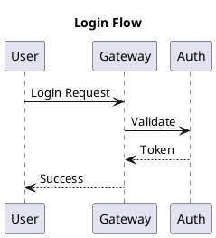
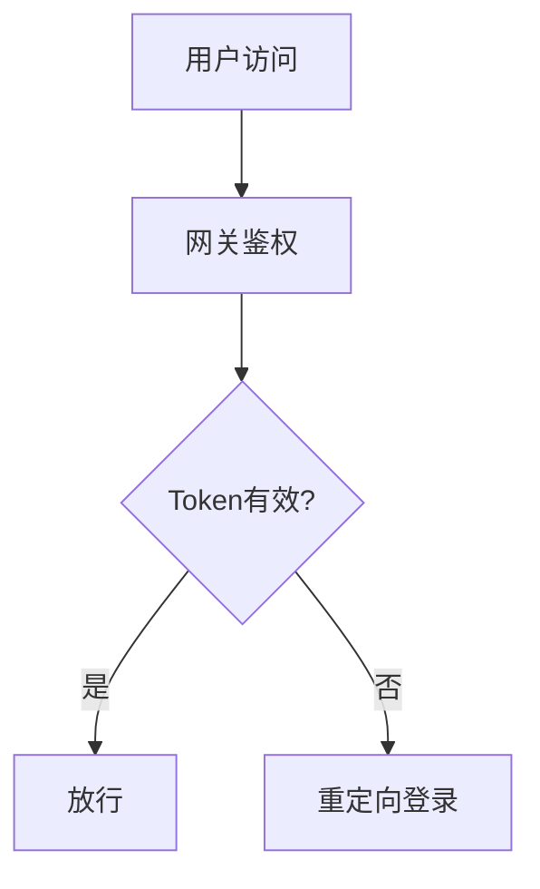

# 统一登录改造方案
> 状态：draft | 负责人：张三 | 日期：2025-02-18

## TL;DR
- 统一鉴权入口，降低多系统登录成本
- 兼容旧系统，分阶段灰度上线

---

## 背景
当前多系统登录入口分散，用户切换频繁，体验割裂。

## 目标
- 单点登录体验
- 统一风控策略
- 降低维护成本

## 非目标
- 不改造业务系统内部权限模型
- 不替换现有用户体系

## 方案概览
### 架构概览


```callout type=warning
风险：旧系统回调标准不一致，可能导致登录失败回退。
```

## 详细设计
### 登录时序


### 流程图（可选）


## 约束与假设
- 需要兼容旧版 SDK
- 灰度开关可按业务线配置

## 风险与对策
- 风险：回调不一致  
  对策：网关层兜底处理

## 决策与下一步
- 决策：先改造网关，再改造入口  
- 下一步：联调+灰度

## 附录
- 参考文档链接：...
